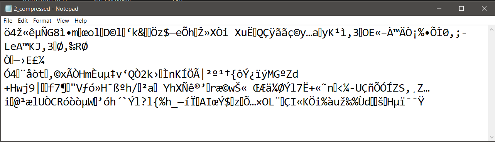

# Shannon-Fano-Data-Compression
Shannon Fano is Data Compression Technique. I have implemented c++ code for this coding technique.

# Steps
    1. Write any content in "ab.txt" file.
    2. Run "32_Shannon_Fano.cpp" file.
    3. Compare "ab.txt" file and "2_compressed.txt" file.
# Working
A. Input File (Size = 536 bytes)

B. Compressed File (Size = 312 bytes)

